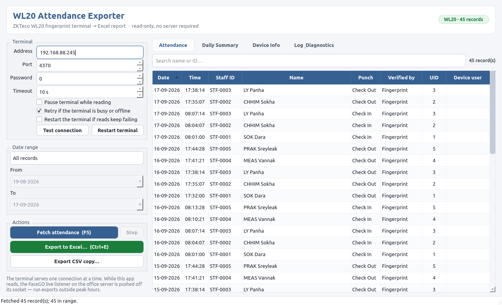
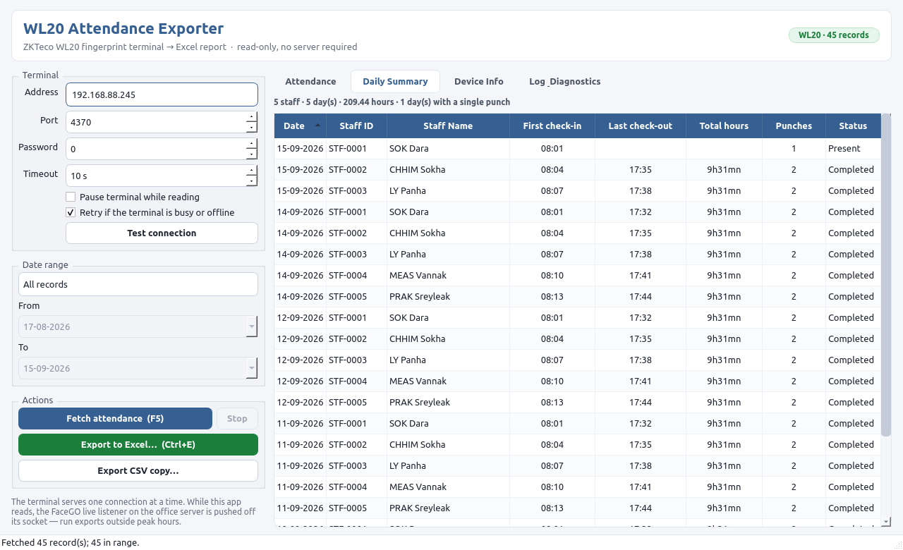

# WL20 Attendance Exporter

Cross-platform desktop app (Windows / macOS / Linux) that downloads all attendance
records from a **ZKTeco WL20 fingerprint terminal** over the office LAN and exports
them to a formatted **Excel (.xlsx)** workbook.



- **No server required** — talks straight to the terminal on TCP port 4370 (ZK protocol, read-only).
- **Reused, battle-tested parser** — handles the WL20 firmware quirks (broken record
  counters, 8/16/40-byte records, 22-byte compressed records).
- **Read-only** — never clears, modifies or disables records on the terminal.
- **Exports** attendance records, a daily first-in/last-out summary, device info and a
  diagnostics sheet (bilingual Khmer + English headers).



## ការប្រើប្រាស់ (Khmer quick start)

1. ភ្ជាប់កុំព្យូទ័រទៅបណ្តាញការិយាល័យ ដូចគ្នានឹងម៉ាស៊ីនស្កេនស្នាមម្រាមដៃ។
2. បើកកម្មវិធី រួចពិនិត្យ **Address** (លេខ IP របស់ម៉ាស៊ីនស្កេន)។
3. ចុច **Fetch attendance (F5)** ដើម្បីទាញយកទិន្នន័យវត្តមានទាំងអស់។
4. ជ្រើសចន្លោះកាលបរិច្ឆេទ បន្ទាប់មកចុច **Export to Excel… (Ctrl+E)**។
5. ឯកសារ Excel មានសន្លឹក 4៖ វត្តមាន, សេចក្តីសង្ខេបប្រចាំថ្ងៃ, ព័ត៌មានឧបករណ៍, និងរោគវិនិច្ឆ័យ។

## Download

Grab the build for your OS from the **Releases** page (built automatically for
Windows, macOS and Linux by GitHub Actions). The repository is public, so no
GitHub account is needed — download straight from the machine that will run the
app rather than copying it between computers.

| OS | File | What it is |
| --- | --- | --- |
| Windows | `WL20-Attendance-Exporter-Setup-<version>.exe` | normal installer: per-user (no admin rights needed), Start Menu entry, uninstaller |
| Windows (portable) | `WL20-Attendance-Exporter.exe` · `-windows-folder.zip` | run without installing (the zip is for machines where antivirus blocks the single file) |
| macOS | `WL20-Attendance-Exporter-macos.dmg` | open the disk image and drag the app to Applications |
| macOS (zip) | `-macos.zip` | the same app bundle without the disk image |
| Linux | `WL20-Attendance-Exporter` | single-file executable (chmod +x and run) |

No Python installation is needed for the packaged builds. The builds are not
code-signed: on Windows choose *More info → Run anyway* (SmartScreen), on macOS
right-click the app → *Open* (Gatekeeper). Verify the download against
`SHA256SUMS.txt` from the same release.

Each release is built and then **installed/mounted on its own platform by CI**: the
Windows installer is run silently from PowerShell and the installed app is executed,
and the macOS disk image is mounted and the app inside it is launched — so a broken
installer cannot reach the Releases page.

**Save the file to a real folder before running it.** Launching it straight from
the browser's download bar runs it out of Chrome/Edge's temporary `scoped_dir`,
where the single-file build can fail with *"Could not load PyInstaller's embedded
PKG archive from the executable"* (and antivirus on locked-down machines blocks
exactly that). If the single-file `.exe` still refuses to start, use the
**folder** zip: unpack it anywhere and run `WL20-Attendance-Exporter.exe` inside —
it needs no self-extraction. Verify the hash first:

```powershell
Get-FileHash .\WL20-Attendance-Exporter.exe -Algorithm SHA256
```

The Linux build needs the usual Qt runtime libraries — present on every desktop
install, and available as `libegl1 libgl1 libxkbcommon0 libdbus-1-3 libfontconfig1`
on a minimal/headless distribution.

## Run from source

```bash
python3 -m venv .venv && source .venv/bin/activate   # Windows: .venv\Scripts\activate
pip install -e .
python -m wl20_exporter            # GUI
wl20-export --host 192.168.88.245  # CLI
```

## CLI

```bash
# Everything on the device → Excel
wl20-export --out attendance.xlsx

# A date range, plus a CSV copy of the raw records
wl20-export --from 01-09-2026 --to 15-09-2026 --out september.xlsx --csv september.csv

# Just test the connection / dump diagnostics
wl20-export --test
```

Dates are **DD-MM-YYYY** everywhere — in the app, in the Excel columns, in the CSV
and on the command line (`YYYY-MM-DD` is still accepted).

CLI options: `--host --port --password --timeout --from --to --out --csv --test --verbose`
plus the retry flags below.

## If the terminal is busy, offline or rebooting

The WL20 accepts one session at a time (the FaceGO server normally holds it) and is
unreachable while it reboots, so an export has to wait it out instead of failing:

- **In the app**: *Retry if the terminal is busy or offline* is on by default. It keeps
  trying for up to 5 minutes, logging every attempt, and the **Stop** button cancels the
  wait immediately.
- **CLI**: `--retries N` (attempts, default 1) with `--retry-delay SECONDS`, or
  `--wait-for-device SECONDS` to keep trying until that deadline regardless of attempts.
- **Terminal genuinely wedged?** Reboot it remotely — see below.

## Restarting the terminal

The app can reboot the terminal over the ZK protocol (the same `CMD_RESTART` the FaceGO
repo's `scripts/restart_wl20.py` sends). Attendance records live in flash, so a reboot
never loses them; the terminal is offline for roughly 1-2 minutes and FaceGO reconnects
on its own when it returns.

- **In the app**: the **Restart terminal** button (it asks first), and the optional
  *Restart the terminal if reads keep failing* — off by default, a last resort that
  reboots and reads once more when the retries above are used up.
- **CLI**: `wl20-export --restart` reboots and waits for it to come back (exit 0 when it
  does); `--restart-if-needed` lets a normal export reboot the terminal if it stays
  unreadable, and `--restart-wait SECONDS` (default 180) sets how long to wait after a
  reboot.

A terminal that is completely unreachable cannot be rebooted remotely — there is nothing
to send the command to — so the app only waits in that case.

Unattended daily export on the Jetson (waits up to 10 minutes for the terminal):

```bash
mkdir -p ~/wl20-exports
crontab -e     # then add, on one line:
# 30 18 * * * cd ~/Desktop/wl20-attendance-exporter && .venv/bin/wl20-export --from $(date +\%d-\%m-\%Y) --to $(date +\%d-\%m-\%Y) --wait-for-device 600 --out $HOME/wl20-exports/$(date +\%d-\%m-\%Y).xlsx >> $HOME/wl20-exports/cron.log 2>&1
```

On Windows the same command works under Task Scheduler.

## Important: one TCP session per terminal

The WL20 serves **one client at a time**. While this app is reading, the FaceGO
realtime listener on the office server cannot hold its socket, and a fingerprint
scan made during the read may be missed by the live system (the device's own flash
still holds the record — the next FaceGO sync picks it up). Run exports outside
peak hours, or read from the FaceGO API instead when the server is up.

## Build installers

```bash
pip install .[build]
pyinstaller packaging/wl20-exporter.spec
```

`packaging/wl20-exporter.spec` works on all three platforms; `.github/workflows/build.yml`
runs exactly that on every push (tests included) and attaches the Windows, macOS and
Linux builds to a GitHub release on every `v*` tag:

```bash
git tag v1.0.0 && git push --tags
```

Each build is verified after freezing with the packaged app's own smoke test:

```bash
dist/WL20-Attendance-Exporter --selftest   # boots Qt + parser + exporter offscreen
```

## Icon

The app icon is the office **AIFarm** mark (cow head in the yellow frame), derived
from `static/src/AIFarm_Logo _cropped.png` in the FaceGO repo. Regenerate the
`.png` / `.ico` / `.icns` set after any logo change:

```bash
python tools/make_icon.py --source "/path/to/AIFarm_Logo _cropped.png"
```

The window icon loads at runtime from the bundled PNG, so it shows up in the
Windows taskbar, the macOS dock and Linux window lists alike.

## Excel output

The workbook mirrors the office **FaceGO attendance log** (`.recording_log/<Month>_<Year>_attendance.xlsx`):
one sheet per day, named DD-MM-YYYY, newest day first, with the same seven columns:

| No. | Staff ID | Staff Name | First Check-in | Last Check-out | Total Hours | Status |
| --- | --- | --- | --- | --- | --- | --- |

- Times are **HH:MM**, hours read like the log (`9h31mn`), and a day with no check-out
  yet leaves the last check-out and the hours blank and reads **Present** (otherwise
  **Completed**).
- Header style is the office palette (white on `#366092`); nothing else is decorated.
- `--punches` adds a raw punch-list sheet per day (the export's equivalent of FaceGO's
  `_raw_log.xlsx`), `--details` adds the Device Info and Diagnostics sheets used for
  troubleshooting. Both are off by default.

## Tests

```bash
python -m unittest discover -s tests -v
```

The parser tests use synthetic device payloads, so they run with no device attached.
